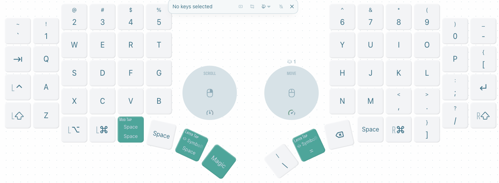
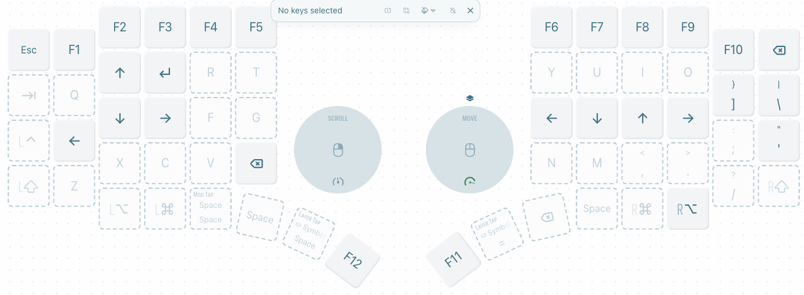
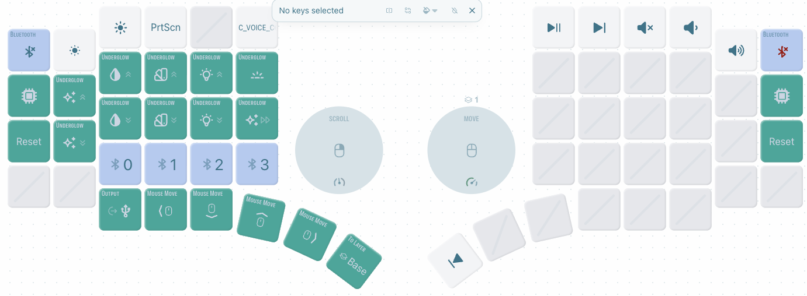
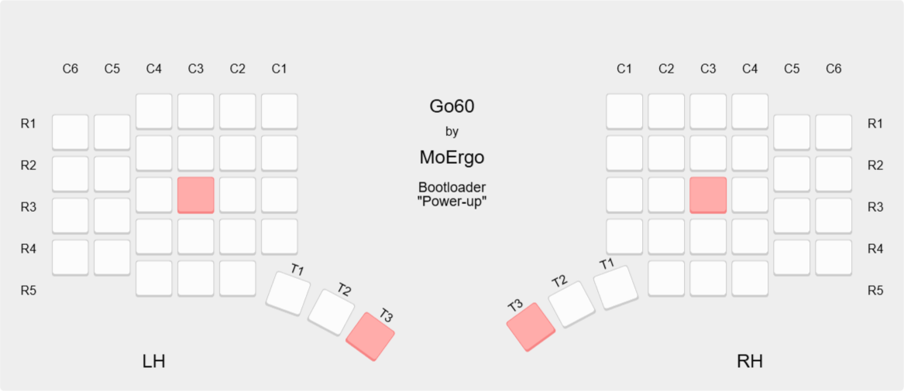
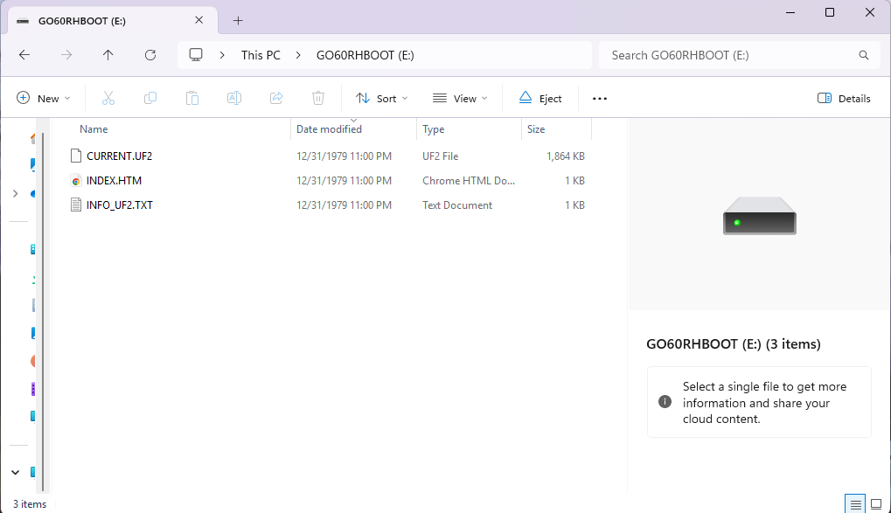

# go60 Setup
## 1. build by actions
## 2. 電源投入時にブートローダーのマスストレージデバイスモードに入る

https://docs.moergo.com/go60-user-guide/customizing-key-layout/#putting-go60-into-bootloader-for-firmware-loading

左半分をブートローダーの大容量ストレージデバイスモードにするには:

- 左半分の電源スイッチをオフにします
- ホストからのUSBケーブルを左半分に接続します
- 上記の行-列キーを参考に、T3+ C3R3（デフォルトレイアウトでは Ctrl+D ）を押し続けます。
  - 右半分: T3+ C3R3（デフォルトレイアウトではAlt+K ）を押し続けます。
- 2つのキーを押しながら、左半分の電源スイッチをオンにします

## 3. Go60左右に新しいZMKファームウェア .uf2 をロードする

https://docs.moergo.com/go60-user-guide/customizing-key-layout/#loading-new-zmk-firmware-onto-your-go60

成功すると、ブートローダーはUSBマスストレージデバイスを表示します。

.UF2ファイルをこの大容量記憶装置にコピーします。成功すると、大容量記憶装置は消えます。

ファームウェア バージョンの変更後、または詳細構成に変更を加えた後は、通常、構成を工場出荷時状態にリセットし、左半分と右半分を再度ペアリングする手順を実行することをお勧めします。
https://docs.moergo.com/go60-user-guide/troubleshooting/#configuration-factory-reset-and-re-pairing-left-and-right-halves

注記

- 新しいファームウェアをロードせずにブートローダーを終了する必要がある場合は、電源スイッチを使用して Go60 の電源をオフにしてから再度オンにします。
- UF2ファイルをCURRENT.UF2に名前変更する必要はありません。拡張子が.UF2のファイル名であれば何でも構いません。
- macOSの最新バージョンでは、UF2ファイル名が長すぎるとファイルのコピーに失敗します。この問題を回避するには、コピー前にファイル名を短く変更してください。 詳しくは、こちらのトラブルシューティングFAQをご覧ください。
- OSがファイルのコピーに失敗したと報告したにもかかわらず、大容量記憶装置が自動的に閉じられた場合、ファイルのコピーは実際には成功しています。詳しくは、こちらのトラブルシューティングに関するFAQをご覧ください。

This repo is the official ZMK configuration of the MoErgo Go60 wireless split keyboard. Use it to develop your own keymap and easily build your own ZMK firmware to run on your Go60.

**NOTE: You can also customize the layout of your Go60 keyboard with the Go60 Layout Editor webapp. For most users Go60 Layout Editor is the recommended and simpler option. More information is available at the official MoErgo Go60 Support site (see resources below).**

These steps will get you using your keymap on your keyboard in the fastest time possible. It uses the GitHub Actions feature to build your firmware online.

If you are looking to dig deeper into ZMK and develop new functionality, it is recommended to follow the steps of installing ZMK as found on the official ZMK documentation site (linked below).

## Resources
- The [official MoErgo Go60 Support](https://moergo.com/go60-support) web site. Go60 documentation and other technical resources.
- The [official MoErgo Discord Server](https://moergo.com/discord). Instant conversations with other Go60 users.

- The [official ZMK Documentation](https://zmk.dev/docs) web site. Find the answers to many of your questions about ZMK Firmware.
- The [official ZMK Discord Server](https://discord.gg/8cfMkQksSB). Instant conversations with other ZMK developers and users. Great technical resource!

- The [official MoErgo ZMK Distribution](https://github.com/moergo-sc/zmk). Repository for ZMK firmware customized for Go60 and Glove80.

## Instructions
1. Log into, or sign up for, your personal GitHub account.
2. Create your own repository using this repository as a template ([instructions](https://docs.github.com/en/repositories/creating-and-managing-repositories/creating-a-repository-from-a-template)) and check it out on your local computer.
3. Edit the keymap file(s) to suit your needs
4. Commit and push your changes to your personal repo. Upon pushing it, GitHub Actions will start building a new version of your firmware with the updated keymap.

## Firmware Files
To locate your firmware files and reflash your Go60...
1. log into GitHub and navigate to your personal config repository you just uploaded your keymap changes to.
2. Click "Actions" in the main navigation, and in the left navigation click the "Build" link.
3. Select the desired workflow run in the centre area of the page (based on date and time of the build you wish to use). You can also start a new build from this page by clicking the "Run workflow" button.
4. After clicking the desired workflow run, you should be presented with a section at the bottom of the page called "Artifacts". This section contains the results of your build, in a file called "go60.uf2"
5. Download the go60.uf2
6. Flash the firmware to Go60 according to the user documentation on the official Go60 Support website (linked above)

Your keyboard is now ready to use.
